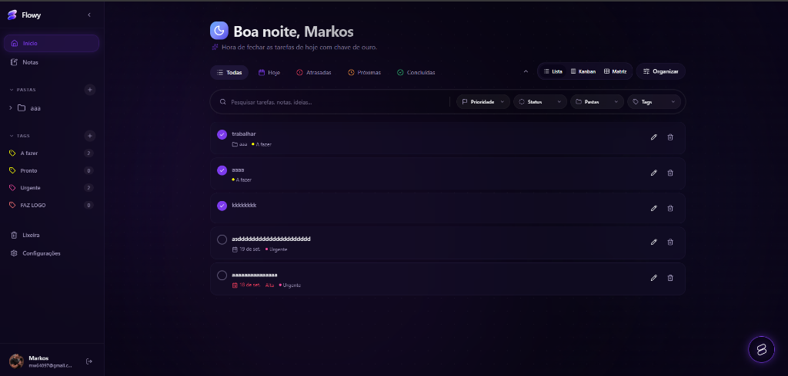
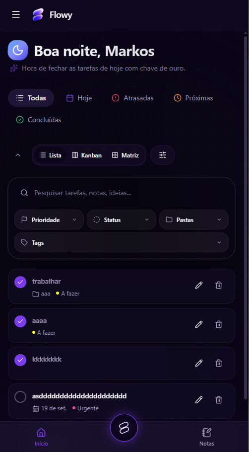
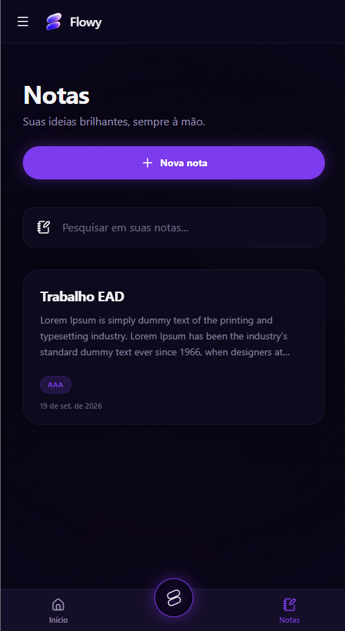

<p align="center">
  
</p>
<h1 align="center">Flowy</h1>

<p align="center">
  <em>Aplicação pessoal de produtividade para gerenciar sua vida com foco e leveza.</em>
</p>

## 📸 Interface

<div align="center">
  
</div>

<br/>

<p align="center">
  
  &nbsp;&nbsp;&nbsp;&nbsp;
  
</p>

## 🚀 Sobre o Projeto
Flowy é uma aplicação de produtividade desenvolvida com as melhores práticas de mercado. Ela reúne tarefas, notas, pastas, categorias, Kanban, busca global e lixeira com retenção de sete dias, tudo em uma interface escura (dark mode) moderna, responsiva e com alta performance.

## 🛠️ Tecnologias
- **Frontend:** Next.js, React, Tailwind CSS, Lucide Icons, TipTap (Editor)
- **Backend/Auth/DB:** Supabase
- **Quality Assurance:** ESLint, TypeScript, Playwright (E2E)

## 💻 Configuração Local

### Requisitos
- Node.js 22 ou superior
- Um projeto Supabase
- Supabase CLI para aplicar as migrations

### Instalação

Abra `Flowy.code-workspace` no VS Code para carregar somente este projeto. Isso evita conflitos com outras extensões.

1. Copie o arquivo modelo de ambiente:
   ```bash
   cp .env.example .env.local
   ```
2. Preencha a URL e a chave pública do seu projeto Supabase no arquivo `.env.local`. *(Nunca coloque sua `service_role` ou chaves secretas em variáveis `NEXT_PUBLIC_*`).*

3. Instale as dependências:
   ```bash
   npm install
   ```
4. Aplique as migrations do banco de dados (detalhes em `supabase/README.md`).
5. Inicie o servidor de desenvolvimento:
   ```bash
   npm run dev
   ```

## 🧪 Qualidade e Testes

O Flowy possui um pipeline de testes rigoroso. Na primeira execução dos testes visuais E2E, instale o navegador do Playwright:

```bash
npx playwright install chromium
```

Comandos disponíveis:
```bash
npm run lint         # Verifica qualidade do código
npm run typecheck    # Verifica integridade do TypeScript
npm test             # Roda os testes unitários
npm run test:e2e     # Roda testes automatizados de fluxo visual
npm run build        # Simula compilação de produção
```

> **Nota:** Os testes E2E públicos verificam a renderização do login e a proteção das rotas. Fluxos autenticados exigem uma conta de teste e um projeto Supabase dedicado.
